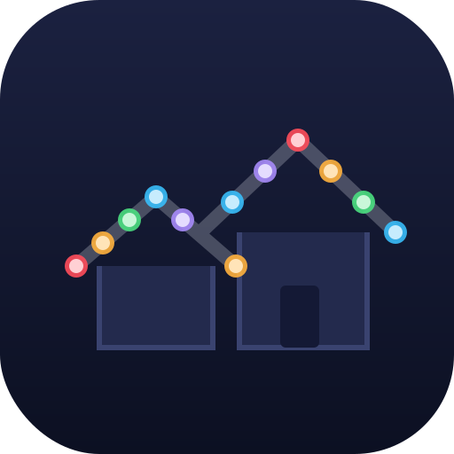

<p align="center"></p>

<h1 align="center">homebridge-gouly</h1>

<p align="center">Control Gouly permanent outdoor lights from Apple Home, locally, with no cloud.</p>

<p align="center">
  <a href="https://www.npmjs.com/package/homebridge-gouly"></a>
  <a href="https://github.com/maxrogers/homebridge-gouly/actions"></a>
  <a href="LICENSE"></a>
</p>

> Not affiliated with or endorsed by Gouly. "Gouly" is used only to describe compatibility.

## Features

- **On/off, brightness and full color** from the Home app, Siri, scenes and automations
- **Warm white done right**: the color-temperature slider uses the dedicated warm white LEDs at the warm end, RGB white at the cool end
- **A separate power switch** for one-tap on/off, next to the dimmable light
- **Your Gouly patterns as HomeKit switches**: record any pattern you apply in the Gouly app (built-in, custom or downloaded) and add it to HomeKit
- **Pattern editor** with a live animated house preview, plus "Show on house" to play any pattern on your real lights
- **Pattern groups** (optional): each group becomes its own tile, for example Holidays and Everyday
- **Stays in sync** with changes made in the Gouly app
- **Handles fast input**: quick slider drags and rapid switching are coalesced so the controller is never flooded
- **Finds the controller on your network** and follows it if its IP address changes
- Optional Adaptive Lighting

## Requirements

- Homebridge 1.8 or later (2.x supported), Node.js 20, 22 or 24
- **Python 3** available to Homebridge. The official Homebridge Docker image and the Raspberry Pi image include it. The Tuya library the plugin uses is bundled, so nothing needs to be installed with pip.
- A Gouly Wi-Fi controller. Tested with the single-output GOULY controller (Tuya protocol 3.4). The 4-output Gouly Pro has experimental support for on/off, brightness and color.
- The controller's **Device ID** and **Local Key** (see below)

## Setup

1. Install **homebridge-gouly** from the Plugins tab in the Homebridge UI.
2. Get your controller's Device ID and Local Key with the [gouly-keys instructions](https://github.com/mikemaat/ha-gouly#1-get-your-device-id-and-local-key) from the ha-gouly project. It needs a Windows PC, Linux PC or Intel Mac; it does not currently work on Apple Silicon Macs. Resetting or re-pairing the controller in the Gouly app changes its key.
3. Open the plugin's settings, go to **Settings**, and enter a name, the Device ID and the Local Key. Press **Find** to locate the controller on your network, or type its IP address. Giving it a DHCP reservation in your router is recommended.
4. Press **Save** and restart Homebridge. Running the plugin as a [child bridge](https://github.com/homebridge/homebridge/wiki/Child-Bridges) is recommended.

In the Home app you get **House Lights** (the dimmable color light) with a **House Lights Power** switch. To give the power switch its own tile, open the accessory's settings and choose **Show as Separate Tiles**.

## Patterns

1. In the plugin settings, open **Patterns** and press **Record**. The page switches to the **Recorded** tab.
2. Apply patterns in the Gouly app. Each new one appears as a card with an animated preview and a description such as *Follow · red/white/green · right · speed 2*.
3. Rename it if you like (and pick a group, if you use groups), then **Add to HomeKit**. Press **Save** and restart Homebridge.

Each pattern becomes a switch in the **House Lights Patterns** accessory; turning one on turns the others off. Changes on the settings page apply to HomeKit when you click **Save**; a note appears above the Save button whenever there are unsaved changes. Closing the settings window stops recording and any *Show on house* preview. **+ New pattern** opens the same editor to build one from scratch. Use the **Show on house** switch on any card to play it on your lights before adding it.

**Groups**: turn on *Organize patterns into groups* under Settings, Advanced. Each group gets a tab on the Patterns page and its own tile in the Home app, named whatever you like; tap a group's tab again to rename or delete it. Moving a pattern to another group creates a new switch, so scenes that used it need updating. A group with a single pattern shows in the Home app as just that switch (HomeKit only groups tiles with two or more switches), and the Home app keeps a tile's name from when it was first added, so rename existing tiles in the Home app itself.

## Troubleshooting

| Symptom | What to check |
|---|---|
| `Could not run the Python bridge` | Python 3 is missing or not on the PATH. Install it, or set *Python 3 path* under Settings, Advanced. |
| Connects but nothing happens, or `Check device key or version` | The Local Key is wrong or changed (re-pairing in the Gouly app changes it). Get the key again. |
| `Connected using Tuya protocol X, not the configured Y` | Your controller uses a different protocol version; it still works, and setting *Tuya protocol* under Settings, Advanced makes connecting faster. |
| `Protocol 3.5 needs the Python 'cryptography' package` | Run `pip3 install cryptography` where Homebridge runs, then restart. |
| The Gouly app says the controller may be paired with another device | The controller allows only a few local connections. Power-cycle it. |
| `Unrecognized command ... from the controller or Gouly app` | Harmless. Please [open an issue](https://github.com/maxrogers/homebridge-gouly/issues/new?template=controller_report.yml) saying what you did in the app just before, so it can be decoded. |

**Reporting a problem:** turn on **Detailed logging** (Settings, Advanced), reproduce the problem, then use **Download debug report** at the bottom of the Settings tab and attach the file to a [bug report](https://github.com/maxrogers/homebridge-gouly/issues/new?template=bug_report.yml). The report gathers your settings, what the controller reported (type, firmware, pixel count, LED settings), connection history, recent commands, the last network search and the plugin's log lines. It never contains your Local Key, and *Hide IP and MAC addresses* masks network details. Settings, Advanced, **Controller info** shows what the controller last reported, with a **Refresh from controller** button.

**Find** (next to the IP address) explains what it is doing: which devices answer on the Tuya port, their MAC addresses, and, once the Device ID and Local Key are entered, which one accepts the key and what type of controller it is.

To check the connection outside Homebridge, stop the plugin's child bridge and run:

```bash
python3 /path/to/node_modules/homebridge-gouly/python/check_bridge.py /path/to/config.json
```

The lights should switch off for 3 seconds and back on. `python/sniff.py` logs every command the controller sends while you use the Gouly app, which helps with bug reports and new controller models. Neither tool prints your key.

## How it works

The controller is a Tuya Wi-Fi module; Gouly's commands travel inside Tuya data point 101. The plugin talks to it directly over your network through a small Python helper built on [tinytuya](https://github.com/jasonacox/tinytuya), because Node's Tuya libraries lose track of this controller's protocol 3.4 sessions. See [PROTOCOL.md](PROTOCOL.md) for the command reference and [ARCHITECTURE.md](ARCHITECTURE.md) for the design.

## Support and contributing

- Found a bug? [Report it](https://github.com/maxrogers/homebridge-gouly/issues/new?template=bug_report.yml). Please never post your Local Key.
- Have a Gouly Pro or another model? A [controller report](https://github.com/maxrogers/homebridge-gouly/issues/new?template=controller_report.yml) with `sniff.py` output helps add support.
- Ideas and pull requests are welcome; see [CONTRIBUTING.md](CONTRIBUTING.md).
- If this plugin brightens your house, you can [buy me a coffee](https://ko-fi.com/maxrogers).

## Acknowledgements

- [ha-gouly](https://github.com/mikemaat/ha-gouly) by Mike Maat: the first public documentation of the Gouly protocol and the gouly-keys tool
- [tinytuya](https://github.com/jasonacox/tinytuya) by Jason Cox and [pyaes](https://github.com/ricmoo/pyaes) by Richard Moore, bundled under their MIT licenses (see [THIRD_PARTY_NOTICES.md](THIRD_PARTY_NOTICES.md))

## License

[MIT](LICENSE)
